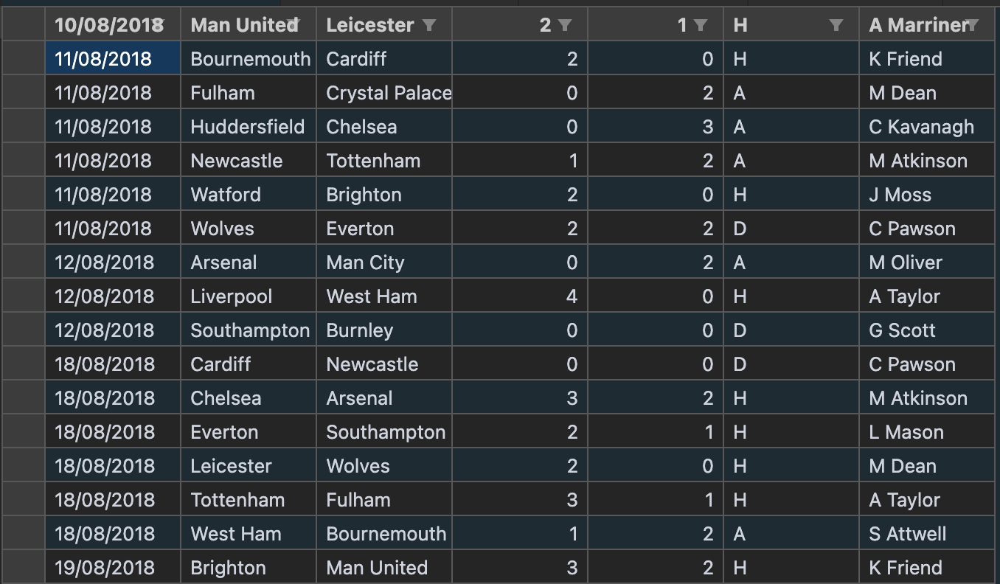
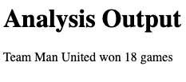

# csv-analyzer

Small app (developed in typescript) that generates reports based on different .csv files.
The .csv file used contains data about Premier League Matches from the 2018/2019 season.

The app generates (with the use of typescript) a report based on the team name (ex. Man United).

